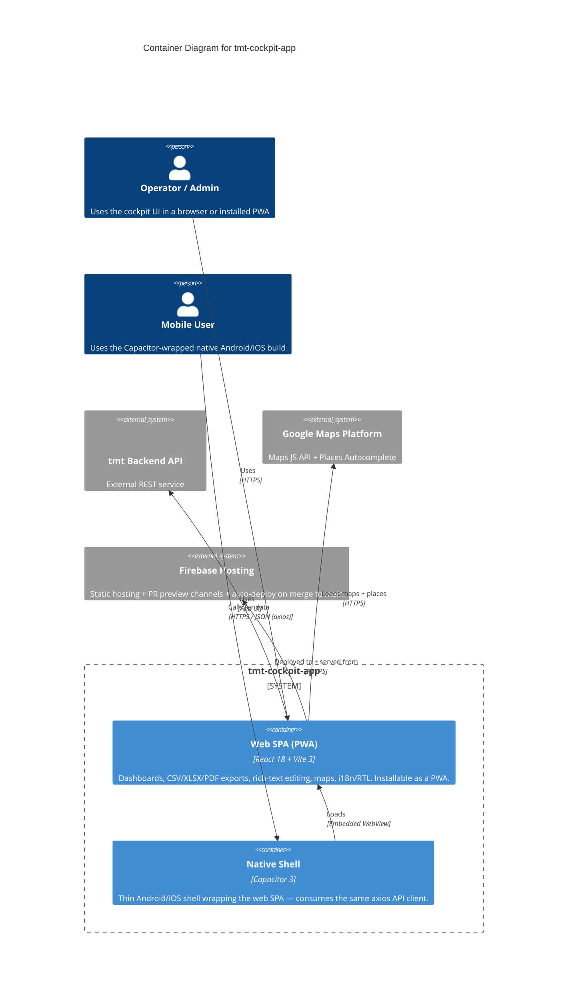

# Container Diagram — tmt-cockpit-app

> **C4 Level 2** — the system broken down into deployable/runnable containers. Audience: the dev team. One diagram per managed project; usually zoomed in from the L1 context diagram.

## Diagram

> **Note**: this diagram was auto-generated by `/handover` on 2026-04-19 from repo signals (`package.json`, `vite.config.js`, `vercel.json` [unused], `.github/workflows/firebase-hosting-*.yml`, `.env.example`, Capacitor config). It is a **starting point** — review and refine.
>
> - Container labels and tech strings — the detector may have picked a framework version wrong
> - Inferred relationships — `user → web` assumes HTTPS; adjust if your stack uses something else
> - External systems — anything your team uses that isn't in `package.json` (e.g. infra-only dependencies, direct cloud APIs called via HTTP) won't have been detected. The **backend API** (`VITE_API_URI`) is inferred as a single external service; if there are multiple, split it here. The **native Capacitor shell** is included because it's in `dependencies` — confirm whether an active mobile build exists before treating it as a real container.
>
> Update the "Maintenance" section below once the diagram is stable.

## Maintenance

(From the template — update when L2 containers change.)
